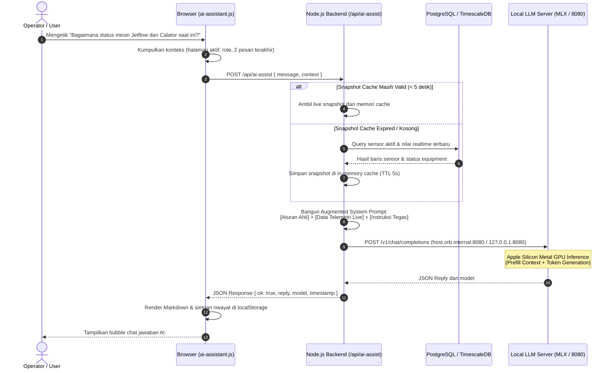

# Blueprint & Panduan Implementasi: Arsitektur AI Chat Assistance

Dokumen ini merangkum seluruh arsitektur, alur data (*end-to-end flow*), kode inti, dan *best practices* dari sistem **AI Chat Assistance** yang dapat langsung direplikasi pada proyek-proyek web/industrial monitoring lainnya.

---

## 1. Arsitektur Tingkat Tinggi (High-Level Architecture)

```mermaid
graph TD
    subgraph Frontend ["Frontend (Browser)"]
        UI["Chat FAB & Drawer (ai-assistant.js)"]
        CTX["Client Context Collector (Active Page, Role, History)"]
    end

    subgraph Backend ["Backend Service (Node.js API)"]
        API["POST /api/ai-assist"]
        STATUS["GET /api/ai-status"]
        CACHE["In-Memory Cache (Snapshot & Status TTL)"]
        PROMPT["Prompt Engineering & Augmented Context Builder"]
    end

    subgraph Database ["Operational Database (PostgreSQL / TimescaleDB)"]
        MASTER["Master Sensor & Equipment Table"]
        READINGS["Telemetry Readings (Realtime Hypertable)"]
    end

    subgraph LLM ["Local AI Inference Engine (Host Mac Apple Silicon)"]
        MLX["MLX-LM Server (Qwen2.5 / Port 8080)"]
        OLLAMA["Ollama Server (Fallback / Port 11434)"]
    end

    UI -->|1. Submit Chat & Context| API
    UI -->|Poll Status| STATUS
    API -->|2. Check Cache / Query| CACHE
    CACHE -.->|Cache Miss (5s)| MASTER
    CACHE -.->|Cache Miss (5s)| READINGS
    CACHE -->|3. Live Readings Snapshot| PROMPT
    PROMPT -->|4. Augmented Prompt with Data| MLX
    MLX -.->|Fallback if MLX Down| OLLAMA
    MLX -->|5. Generated Markdown Reply| API
    API -->|6. JSON Response| UI
```

---

## 2. Diagram Alur Percakapan (Sequence Flow)



---

## 3. Komponen Utama Sistem & Kunci Keberhasilan

### A. Dynamic Telemetry Context Injection (RAG / Augmented Prompting)
**Masalah Umum:** Model bahasa (LLM) secara *default* tidak memiliki koneksi ke database. Jika ditanya nilai sensor, LLM akan meminta maaf atau mengarang angka (*hallucination*).

**Solusi:**
Backend menginjeksi snapshot data operasional terkini langsung ke dalam `system prompt` sebelum diteruskan ke model.

```javascript
// Struktur System Prompt yang Diinjeksi:
const systemPrompt = `
Kamu adalah ${customRole}.
Karakteristik Pabrik / Sistem: ${plantProfile}

### DATA TELEMETRI LIVE SISTEM MES & SENSOR OPERASIONAL:
- [Jetflow] JF-LA-01: Running (Batch: DB-260815-001, Progress: 64%, Temp: 98°C)
- [Calator] CL-DPN-01: Running (Speed: 32 m/min, Overfeed: 15%)
- [Dryer] DR-DPN-01: Running (Chamber 1: 165°C, Chamber 2: 170°C)
- [Kalender] KL-DPN-01: Running (Upper Felt: 180°C, Lower Felt: 175°C)
- [Solar Fueling] Tangki Utama: Level 82%, Sisa 18.500 Liter

Aturan Respon:
1. Kamu memiliki akses langsung ke data telemetri operasional di atas.
2. Jawab langsung dengan angka aktual dan satuan dari daftar di atas tanpa pernah meminta maaf atau menolak!
`;
```

### B. In-Memory Caching (Proteksi Database)
Agar database tidak mengalami *load spike* saat banyak operator menggunakan chat:
- Snapshot telemetri disimpan di memori selama **5 detik** (`TELEMETRY_CACHE_TTL_MS = 5000`).
- Status kesehatan AI di-cache selama **10 detik** (bila online) dan **1.5 detik** (bila offline untuk pemulihan cepat).

### C. Jaringan Docker-to-Host (Apple Silicon & OrbStack)
Jika aplikasi berjalan di dalam container Docker sementara server LLM (MLX) berjalan di host Mac:
- **OrbStack (macOS):** Menggunakan `http://host.orb.internal:8080` (latensi hanya **~80 ms**).
- **Docker Desktop (macOS):** Menggunakan `http://host.docker.internal:8080`.
- **Host Direct:** Menggunakan `http://127.0.0.1:8080`.

Backend menerapkan *auto-candidate resolution* dan mengingat host yang berhasil (`lastWorkingMlxHost`) sehingga request berikutnya tidak perlu mencoba ulang host yang gagal.

### D. Optimasi Memori Metal GPU (Mencegah Crash OOM)
Pada perangkat dengan RAM terbatas (misal 8 GB / 16 GB Unified Memory):
- Batasi `max_tokens` generasi ke angka praktis: **200–250 token** (cukup untuk 2–3 paragraf ringkas).
- Batasi riwayat chat yang dikirim hanya **2–3 percakapan terakhir** (`slice(-2)`).
- Jalankan server MLX dengan batas eksplisit:
  ```bash
  python3 -m mlx_lm server --model mlx-community/Qwen2.5-Coder-7B-Instruct-4bit --host 0.0.0.0 --port 8080 --max-tokens 250
  ```

---

## 4. Checklist Implementasi untuk Proyek Baru

| No | Tahap | File / Komponen | Tindakan |
|---|---|---|---|
| 1 | **Frontend Widget** | `ai-assistant.js` + `.css` | Buat floating button (FAB), drawer chat responsif, dan handler submit `/api/ai-assist`. |
| 2 | **Status Polling** | `/api/ai-status` | Tampilkan badge status AI di header (Hijau = Online, Merah = Offline). |
| 3 | **Backend Controller** | `ai-assistant.service.ts` | Buat fungsi `handleAiAssistRequest` dan `checkAiStatus`. |
| 4 | **Data Ingestion** | Database Query + Cache | Buat fungsi `getLiveTelemetrySnapshot()` dengan query master data dan pembacaan terbaru (TTL 5 detik). |
| 5 | **System Prompt** | `buildSystemPrompt()` | Format teks sensor menjadi bullet-points markdown dan berikan persona ahli industri terkait. |
| 6 | **LLM Runtime** | MLX / Ollama | Jalankan server LLM lokal pada host dengan endpoint `/v1/chat/completions`. |
| 7 | **Host Resolution** | Candidate Array | Tambahkan `host.orb.internal` dan `host.docker.internal` agar container dapat mengakses host. |
