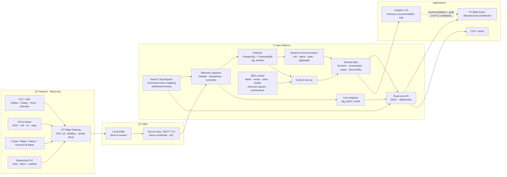
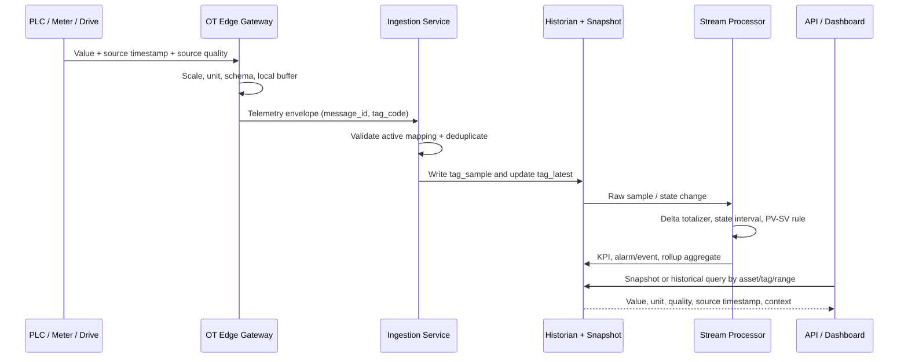
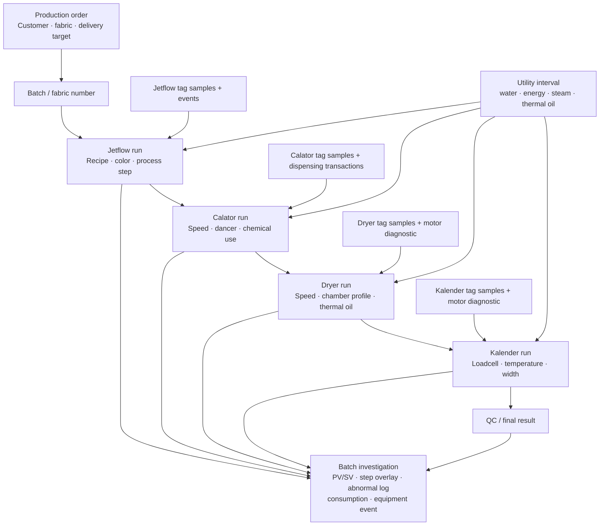
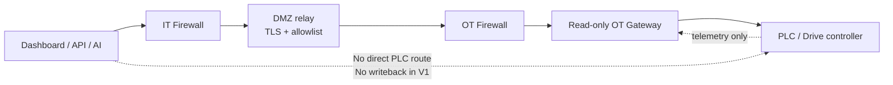

# Backend Data Flow Graph v1.0

**Tanggal:** 15 Agustus 2026  
**Status:** Baseline graph arsitektur data dan traceability

## 1. Alur utama OT ke dashboard

## 2. Siklus satu sample tag

## 3. Traceability batch sampai analisis

## 4. Batas keamanan

## Pembacaan graph

- Registry berada di pusat karena tag yang sama dipakai oleh ingestion, historian, API, dan dashboard binding.
- `tag_sample` menjaga bukti raw data; `tag_latest` menjaga respons live; KPI/event adalah data turunan yang tetap dapat ditelusuri.
- Batch/run menjadi simpul penghubung antara data mesin, utility, chemical, motor, dan QC sehingga analisis ketidaksesuaian tidak hanya melihat satu sensor.
