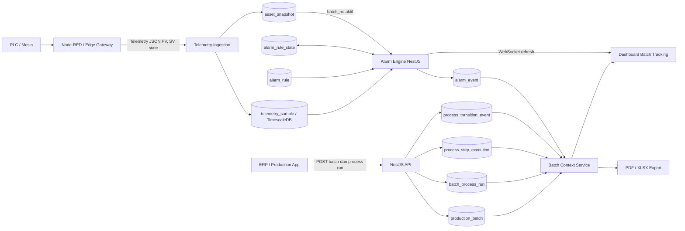
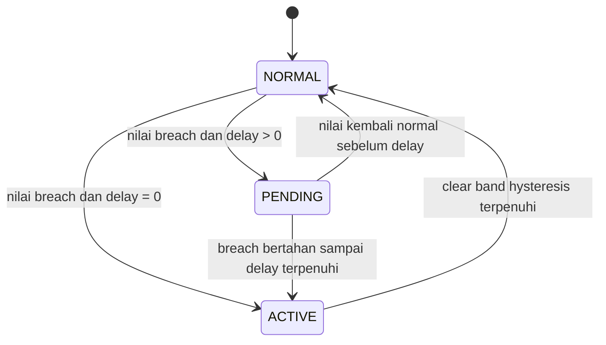
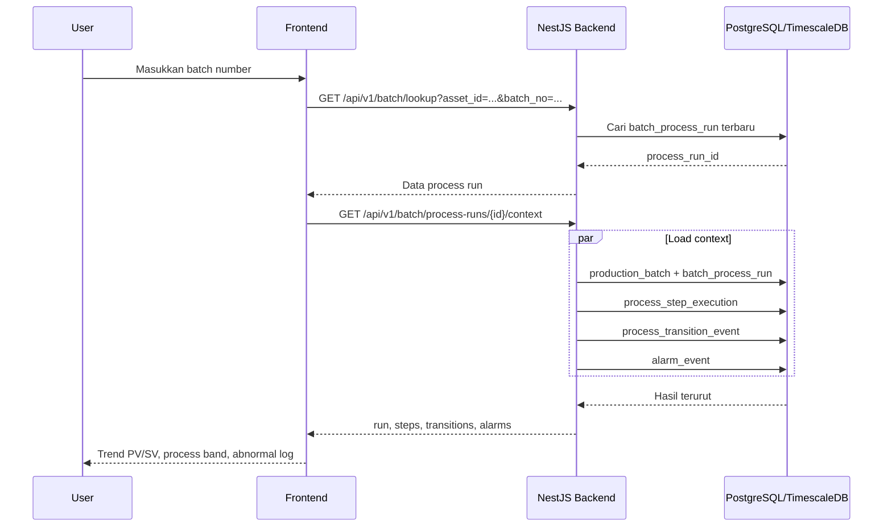
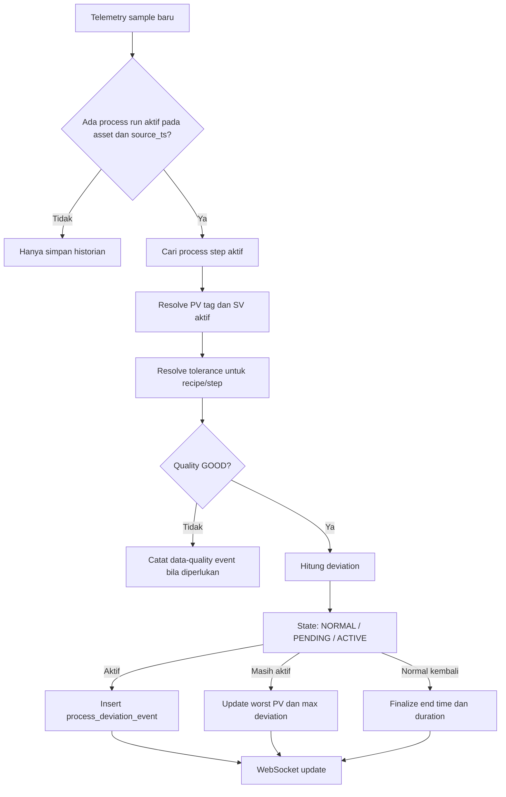

# Batch Abnormal Log Backend Flow v1.0

## Metadata

| Item | Nilai |
|---|---|
| Project | PT.SMM Digital Automation Dashboard |
| Versi dokumen | 1.0 |
| Tanggal | 26 Agustus 2026 |
| Ruang lingkup | Deteksi, penyimpanan, korelasi, query, real-time update, dan export abnormalitas per batch |
| Status | Dokumentasi implementasi aktual dan rancangan pengembangan berikutnya |

## 1. Tujuan

Batch Abnormal Log digunakan untuk menjawab:

- batch mana yang mengalami penyimpangan;
- mesin dan langkah proses mana yang sedang berjalan saat penyimpangan terjadi;
- parameter apa yang menyimpang;
- berapa SV, PV, batas toleransi, nilai terburuk, dan durasinya;
- kapan kondisi mulai dan kembali normal;
- apakah penyimpangan berpotensi memengaruhi kualitas atau output;
- data trend, alarm, state mesin, dan transisi proses mana yang perlu diperiksa saat troubleshooting.

Dokumen ini membedakan dua jenis event:

1. **Equipment/process alarm**: rule ambang statis seperti temperatur lebih dari 170 °C atau arus motor lebih dari 32 A.
2. **Batch process deviation**: penyimpangan terhadap target dinamis suatu batch atau langkah program, misalnya SV temperatur 130 °C tidak tercapai dalam 10 menit.

Keduanya dapat tampil dalam satu Batch Abnormal Log, tetapi sumber dan cara evaluasinya berbeda.

## 2. Status implementasi saat ini

| Komponen | Status | Implementasi saat ini |
|---|---|---|
| Master batch | Sudah ada | `production_batch` |
| Eksekusi batch per mesin | Sudah ada | `batch_process_run` |
| Langkah proses | Sudah ada | `process_step_execution` |
| Transisi langkah | Sudah ada | `process_transition_event` |
| Historian PV/SV | Sudah ada | `telemetry_sample` di PostgreSQL/TimescaleDB |
| Rule HIGH/LOW | Sudah ada | `alarm_rule` |
| State evaluasi rule | Sudah ada | `alarm_rule_state` |
| Event alarm | Sudah ada | `alarm_event` |
| Konteks batch | Sudah ada | `GET /api/v1/batch/process-runs/:processRunId/context` |
| Export PDF/XLSX | Sudah ada | `GET /api/v1/batch/process-runs/:processRunId/export` |
| Evaluasi PV terhadap SV langkah | Belum khusus | Perlu deviation engine |
| Event abnormal khusus batch | Belum ada | Saat ini masih memakai `alarm_event` |
| Relasi langsung event ke `process_run_id` dan `step_execution_id` | Belum ada | Saat ini melalui `batch_no`, atau fallback mesin + rentang waktu |
| Nilai worst PV, max deviation, dan duration | Belum lengkap | Perlu diakumulasi oleh deviation engine |

Catatan: beberapa tampilan lama di frontend masih memiliki template/demo abnormal log. Sumber aktual backend untuk konteks batch dan export adalah `alarm_event`, bukan array demo tersebut.

## 3. Alur backend yang berjalan sekarang



### 3.1 Registrasi batch dan process run

Aplikasi produksi eksternal mengirim metadata batch dan penugasannya ke mesin. Backend menyimpan:

- identitas dan target produksi di `production_batch`;
- periode proses batch pada sebuah mesin di `batch_process_run`;
- recipe/program yang digunakan;
- status `PLANNED`, `RUNNING`, `COMPLETED`, `HOLD`, atau status operasional lain;
- `started_at`, `ended_at`, progress, dan output ketika tersedia.

`process_run_id` adalah identitas internal untuk satu perjalanan batch pada satu mesin. Satu `batch_no` dapat memiliki beberapa process run karena kain melewati beberapa mesin.

### 3.2 Telemetry masuk

PLC atau Node-RED mengirim nilai aktual ke endpoint telemetry. Payload minimum harus membawa:

```json
{
  "message_id": "0a23836a-1558-4fc6-9f91-6c35f120df2c",
  "asset_id": "KL-DPN-05",
  "tag_code": "SMM.KL-DPN-05.UPPER_FELT.TEMPERATURE_PV",
  "source_ts": "2026-08-26T10:15:00+07:00",
  "value_number": 126.4,
  "quality": "GOOD",
  "gateway_id": "GW-KL-DPN-01"
}
```

Nilai historis disimpan di `telemetry_sample`. Nilai terakhir mesin disimpan atau diringkas di snapshot/latest-state untuk live display. `message_id` dipakai untuk idempotency agar retry dari gateway tidak menggandakan sample.

### 3.3 Alarm Engine statis

`AlarmEngineService` berjalan setiap 1 detik dan hanya membaca telemetry baru berdasarkan cursor `telemetry_sample.id`. Backend tidak melakukan scan ulang seluruh historian.

Urutan evaluasinya:

1. Ambil telemetry setelah cursor terakhir, maksimal 5.000 hasil per siklus.
2. Cocokkan `asset_id` dan `tag_code` dengan rule aktif di `alarm_rule`.
3. Abaikan nilai non-numerik dan quality selain `GOOD` untuk perubahan state rule.
4. Evaluasi ambang, delay, dan hysteresis.
5. Simpan state terakhir ke `alarm_rule_state`.
6. Saat rule aktif, insert satu row ke `alarm_event`.
7. Saat nilai kembali pada clear band, update event menjadi `CLEARED`.
8. Publikasikan perubahan melalui WebSocket.
9. Simpan cursor agar proses dapat dilanjutkan setelah backend restart.

Rule breach saat ini:

```text
HIGH atau HIGH_HIGH  : PV >= threshold
LOW atau LOW_LOW     : PV <= threshold
```

Rule clear dengan hysteresis:

```text
HIGH atau HIGH_HIGH  : PV <= threshold - hysteresis
LOW atau LOW_LOW     : PV >= threshold + hysteresis
```

### 3.4 State machine alarm



Saat ACTIVE, hanya ada satu event aktif untuk satu `rule_id`. Ini dijaga oleh unique partial index di database.

### 3.5 Korelasi alarm ke batch saat ini

Saat alarm dibuat, engine membaca `batch_no` dari `asset_snapshot`. Batch hanya ditulis ke `alarm_event` jika nomor tersebut terdaftar di `production_batch`.

Ketika halaman detail batch dibuka, backend mencari event dengan urutan logis berikut:

1. event yang memiliki `alarm_event.batch_no` sama dengan batch;
2. fallback event pada `asset_id` yang sama dan `occurred_at` berada dalam `started_at` sampai `ended_at` process run.

Query aktual secara konsep:

```sql
SELECT *
FROM alarm_event
WHERE batch_no = :batch_no
   OR (
        asset_id = :asset_id
        AND occurred_at >= :run_started_at
        AND occurred_at <= COALESCE(:run_ended_at, NOW())
      )
ORDER BY occurred_at;
```

Fallback waktu menjaga alarm tetap terlihat ketika snapshot batch terlambat diperbarui. Namun, metode ini berpotensi mengaitkan event yang salah apabila dua process run pada mesin yang sama memiliki interval bertumpuk. Karena itu, relasi langsung ke `process_run_id` direkomendasikan pada tahap berikutnya.

## 4. Alur load dan tampilan Batch Abnormal Log



Response context aktual berbentuk:

```json
{
  "data_mode": "ACTUAL_DATABASE",
  "run": {},
  "steps": [],
  "transitions": [],
  "alarms": []
}
```

Export menggunakan process run dan rentang waktu yang sama. XLSX berisi worksheet `Abnormality Log`; PDF memiliki section dengan nama yang sama.

## 5. Keterbatasan implementasi sekarang

Alarm Engine saat ini cocok untuk rule seperti:

- temperatur lebih tinggi dari batas keselamatan/proses;
- level lebih rendah dari batas minimum;
- arus motor melampaui rating;
- pressure berada di luar batas tetap.

Engine tersebut belum cukup untuk aturan kontekstual seperti:

- PV temperatur tidak mencapai SV aktif dalam 10 menit;
- loadcell upper berbeda lebih dari 3% terhadap loadcell lower selama langkah tertentu;
- overspeed hanya abnormal saat program `FINISHING` berjalan;
- temperature deviation memiliki toleransi berbeda untuk setiap recipe;
- step program selesai tetapi actual value tidak memenuhi completion rule.

Alasannya adalah SV dan toleransi pada kasus tersebut berubah menurut batch, recipe, dan step. Rule tidak dapat direpresentasikan hanya dengan satu `threshold_value` statis.

## 6. Rancangan optimal: Process Deviation Engine

Untuk Batch Abnormal Log yang lengkap, gunakan service kedua bernama **Process Deviation Engine**. Service ini terpisah secara logis dari Alarm Engine, tetapi tetap berada di backend NestJS.



### 6.1 Resolusi batch dan langkah

Jangan hanya bergantung pada `asset_snapshot.batch_no`. Untuk setiap `source_ts`, backend mencari:

```sql
SELECT process_run_id, batch_no
FROM batch_process_run
WHERE asset_id = :asset_id
  AND started_at <= :source_ts
  AND COALESCE(ended_at, 'infinity') >= :source_ts
  AND run_status IN ('RUNNING', 'HOLD', 'COMPLETED')
ORDER BY started_at DESC
LIMIT 1;
```

Setelah itu cari step yang interval waktunya mencakup `source_ts`. Dengan cara ini event menyimpan `process_run_id` dan `step_execution_id` secara langsung.

### 6.2 Resolusi SV

Urutan sumber SV yang disarankan:

1. tag telemetry dengan `signal_role = SV` apabila dikirim PLC dan quality `GOOD`;
2. `process_step_execution.setpoint_json` sebagai snapshot setting saat eksekusi;
3. `process_program_step.setpoint_json` sebagai program/recipe master;
4. default dari rule hanya jika ketiga sumber di atas tidak tersedia.

SV yang dipakai saat event aktif harus disalin ke event. Perubahan recipe setelah produksi tidak boleh mengubah riwayat abnormal batch lama.

### 6.3 Rule dinamis yang disarankan

Buat tabel `process_deviation_rule` terpisah dari `alarm_rule` karena tujuan dan konteksnya berbeda.

Field minimum:

| Field | Fungsi |
|---|---|
| `rule_id` | UUID rule |
| `rule_code` | Kode baku dan stabil |
| `asset_type` / `asset_id` | Scope rule |
| `process_type` | Jetflow, Kalender, Calator, Dryer, dan lainnya |
| `step_code` | Step tempat rule berlaku; boleh null untuk seluruh run |
| `pv_tag_role` | Parameter PV yang dinilai |
| `sv_tag_role` | Pasangan SV bila ada |
| `deviation_mode` | `ABSOLUTE`, `PERCENT`, `RANGE`, atau `TIME_TO_TARGET` |
| `tolerance_low` / `tolerance_high` | Batas penyimpangan |
| `delay_seconds` | Waktu sebelum event aktif |
| `clear_delay_seconds` | Waktu stabil sebelum dianggap normal |
| `hysteresis_value` | Mencegah event on/off berulang di batas |
| `severity` | INFO, WARNING, CRITICAL |
| `impact_code` | QUALITY, OUTPUT, DOWNTIME, UTILITY, EQUIPMENT |
| `enabled` | Status rule |
| `calculation_version` | Versi algoritma |
| audit fields | Pembuat, pengubah, waktu, dan approval |

### 6.4 Tabel event abnormal batch yang disarankan

Gunakan tabel khusus agar `alarm_event` tidak dibebani seluruh detail analisis produksi.

```sql
CREATE TABLE process_deviation_event (
  deviation_event_id UUID PRIMARY KEY,
  process_run_id UUID NOT NULL REFERENCES batch_process_run(process_run_id),
  step_execution_id UUID REFERENCES process_step_execution(step_execution_id),
  asset_id TEXT NOT NULL REFERENCES asset(asset_id),
  batch_no TEXT NOT NULL REFERENCES production_batch(batch_no),
  rule_id UUID NOT NULL REFERENCES process_deviation_rule(rule_id),
  event_class TEXT NOT NULL,
  severity TEXT NOT NULL,
  event_state TEXT NOT NULL,
  pv_tag_code TEXT REFERENCES tag_definition(tag_code),
  sv_tag_code TEXT REFERENCES tag_definition(tag_code),
  sv_value DOUBLE PRECISION,
  trigger_pv DOUBLE PRECISION,
  worst_pv DOUBLE PRECISION,
  tolerance_low DOUBLE PRECISION,
  tolerance_high DOUBLE PRECISION,
  max_abs_deviation DOUBLE PRECISION,
  max_deviation_percent DOUBLE PRECISION,
  started_at TIMESTAMPTZ NOT NULL,
  ended_at TIMESTAMPTZ,
  duration_seconds INTEGER,
  impact_code TEXT,
  detail_json JSONB NOT NULL DEFAULT '{}'::jsonb,
  alarm_event_id UUID REFERENCES alarm_event(alarm_event_id),
  calculation_version TEXT NOT NULL,
  created_at TIMESTAMPTZ NOT NULL,
  updated_at TIMESTAMPTZ NOT NULL
);

CREATE INDEX idx_deviation_run_time
  ON process_deviation_event(process_run_id, started_at);

CREATE INDEX idx_deviation_batch_time
  ON process_deviation_event(batch_no, started_at);

CREATE INDEX idx_deviation_asset_active
  ON process_deviation_event(asset_id, event_state, started_at DESC);
```

Tabel ini menyimpan event, bukan setiap sample sensor. Sample tetap berada di hypertable `telemetry_sample`.

### 6.5 Contoh evaluasi PV/SV

Konfigurasi:

```text
Step              : TEMPERATURE_CONTROL
SV                : 130 °C
Tolerance         : -2 / +2 °C
Activation delay  : 60 detik
Clear hysteresis  : 0,5 °C
```

Hasil:

```text
Acceptable band : 128–132 °C
Pending         : PV berada di luar band tetapi belum 60 detik
Active          : PV tetap di luar band selama minimal 60 detik
Cleared         : PV kembali ke clear band dan stabil sesuai clear delay
```

Selama ACTIVE, backend memperbarui `worst_pv`, `max_abs_deviation`, dan durasi. Saat kembali normal, `ended_at` serta `duration_seconds` difinalkan.

## 7. Bentuk data untuk frontend

Endpoint yang direkomendasikan:

```http
GET /api/v1/batch/process-runs/{processRunId}/abnormalities
  ?severity=WARNING,CRITICAL
  &state=ACTIVE,CLEARED
  &event_class=PROCESS_DEVIATION
  &page=1
  &page_size=25
```

Contoh response:

```json
{
  "data_mode": "ACTUAL_DATABASE",
  "process_run_id": "c515e89e-0a14-43f1-84ea-886736f405a3",
  "batch_no": "BATCH-20260826-001",
  "total": 1,
  "items": [
    {
      "deviation_event_id": "0d6fcc74-f0e4-4dbb-b78e-dc12e40b7312",
      "asset_id": "JF-LA-01",
      "step_no": 5,
      "step_code": "TEMPERATURE_CONTROL",
      "parameter": "Main Tank Temperature",
      "sv": 130.0,
      "tolerance": "±2.0 °C",
      "trigger_pv": 127.7,
      "worst_pv": 124.8,
      "max_deviation": -5.2,
      "started_at": "2026-08-26T10:20:00+07:00",
      "ended_at": "2026-08-26T10:27:30+07:00",
      "duration_seconds": 450,
      "severity": "WARNING",
      "impact_code": "QUALITY",
      "event_state": "CLEARED"
    }
  ]
}
```

Kolom tabel frontend minimum:

- start time dan end time;
- batch dan mesin;
- step/process;
- parameter;
- SV dan tolerance;
- trigger PV dan worst PV;
- deviation;
- duration;
- severity dan impact;
- status ACTIVE/CLEARED/ACKNOWLEDGED.

## 8. WebSocket dan UI real-time

Event WebSocket yang disarankan:

- `batch:abnormal-active` saat abnormal baru aktif;
- `batch:abnormal-updated` saat worst PV atau durasi berubah;
- `batch:abnormal-cleared` saat kondisi normal kembali.

Frontend cukup memperbarui row terkait berdasarkan `deviation_event_id`. Jangan me-render ulang seluruh page setiap refresh karena dapat menutup dropdown, menghilangkan tooltip, atau menyebabkan halaman terasa tidak dapat diklik.

Critical event dapat diteruskan ke header alarm, tetapi klik detail harus menuju mesin dan process run yang terkait.

## 9. Tanggung jawab setiap layer

| Layer | Tanggung jawab |
|---|---|
| PLC | Kontrol mesin, safety interlock, trip, SV/PV aktual, step signal |
| Node-RED/edge | Membaca PLC, normalisasi payload, timestamp, quality, retry, idempotency |
| NestJS ingestion | Validasi tag/asset, simpan telemetry, update live state |
| Alarm Engine | Rule ambang statis untuk equipment/process alarm |
| Process Deviation Engine | Rule kontekstual PV/SV per batch, recipe, dan step |
| PostgreSQL/TimescaleDB | Master, event relasional, historian, aggregate, audit |
| Frontend | Konfigurasi yang diizinkan, visualisasi, filter, acknowledgement, export |

Node-RED sebaiknya tidak menjadi sumber utama keputusan abnormal produksi. Node-RED mengirim fakta mentah; backend membuat keputusan berdasarkan rule terversi. Safety tetap harus berada di PLC, bukan dashboard atau database.

## 10. Performa dan retensi

Desain yang efisien:

- engine membaca sample baru dengan cursor, bukan query ulang harian/bulanan;
- telemetry raw disimpan di hypertable TimescaleDB;
- query trend menggunakan continuous aggregate sesuai time range;
- abnormal log dibaca dari tabel event yang kecil dan terindeks;
- event menyimpan snapshot SV, tolerance, dan versi kalkulasi;
- perubahan rule hanya berlaku untuk event baru dan tidak mengubah histori lama;
- export raw telemetry dibatasi dan dapat dipindahkan ke background job jika data sangat besar.

Dengan pola ini, pembacaan log mingguan atau bulanan tidak perlu menghitung ulang jutaan row telemetry.

## 11. Validasi dan commissioning

Sebelum dipakai produksi:

1. pastikan jam PLC, Node-RED, backend, dan PostgreSQL tersinkronisasi;
2. pastikan semua timestamp memakai `TIMESTAMPTZ` dan dikirim dengan offset;
3. verifikasi pasangan tag PV/SV di `tag_definition`;
4. verifikasi batch aktif dan process step tidak tumpang tindih pada satu mesin;
5. uji rule dengan data di bawah, tepat pada, dan di atas batas;
6. uji delay, hysteresis, restart backend, dan retry message;
7. uji quality `BAD`, `UNCERTAIN`, dan stale data;
8. cocokkan start/end event dengan trend sensor;
9. uji export PDF/XLSX terhadap data yang tampil;
10. lakukan sign-off Production, Quality, Maintenance, dan Automation.

## 12. Tahapan implementasi yang direkomendasikan

### Tahap 1 — Perkuat korelasi aktual

- tambahkan `process_run_id` dan `step_execution_id` langsung pada event;
- ubah lookup utama dari snapshot batch menjadi active process run berdasarkan waktu;
- pertahankan fallback mesin + rentang waktu hanya untuk data lama.

### Tahap 2 — Dynamic deviation engine

- buat `process_deviation_rule`;
- buat `process_deviation_event`;
- implementasikan pasangan PV/SV, tolerance, delay, hysteresis, worst PV, dan duration;
- tambahkan endpoint abnormality terpaging.

### Tahap 3 — Korelasi lintas proses

- hubungkan abnormal proses dengan motor, utility, downtime, dan quality result;
- tampilkan event pada trend sebagai marker dan process band;
- buat ranking abnormal per mesin, area, recipe, dan parameter.

### Tahap 4 — Analisis akar masalah dan AI

- bentuk feature set dari deviation, alarm, state, utility, maintenance, dan QC;
- berikan rekomendasi berbasis pola historis;
- tetap simpan evidence, rule version, dan confidence agar hasil dapat diaudit.

## 13. Kesimpulan keputusan arsitektur

Implementasi sekarang sudah dapat menampilkan alarm yang berkaitan dengan batch dan mengekspornya. Namun, Batch Abnormal Log produksi yang benar-benar menjelaskan kegagalan mencapai SV memerlukan Process Deviation Engine dan tabel event khusus.

Prinsip utamanya:

- telemetry menyimpan fakta sensor;
- process run dan step menyimpan konteks produksi;
- rule engine menghasilkan event;
- event menyimpan ringkasan abnormal yang immutable/auditable;
- frontend hanya membaca, memfilter, mengakui, dan memvisualisasikan hasil backend.

