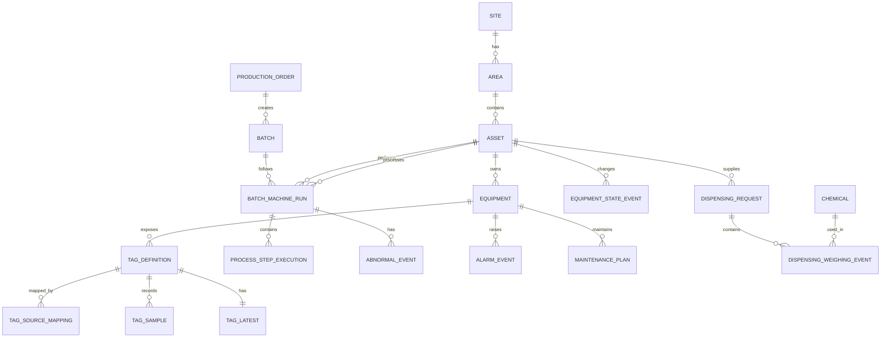

# Database Design Concept v1.0

**Tanggal:** 15 Agustus 2026  
**Status:** Baseline konseptual  
**Tujuan:** Menetapkan struktur database yang menghubungkan telemetry mesin, historian, batch/MES, utilitas, chemical, maintenance, dan dashboard PT.SMM.

## 1. Keputusan platform

Database utama yang disarankan adalah **PostgreSQL dengan ekstensi TimescaleDB**.

- **PostgreSQL** menyimpan master data dan transaksi yang membutuhkan relasi kuat: asset, equipment, tag, batch, recipe, customer, chemical request, alarm, dan maintenance.
- **TimescaleDB** menyimpan telemetry bervolume besar: temperature, speed, ampere R/S/T, voltage, kW, level, flow, totalizer, dan state historis.
- **Redis/cache** bersifat opsional untuk mempercepat nilai live; bukan sumber data utama.
- **Object storage** opsional untuk export CSV/PDF, file recipe, hasil QC, atau lampiran maintenance; metadata file tetap berada di PostgreSQL.

Database tidak diakses langsung oleh PLC atau frontend. Integrasinya adalah:

```text
PLC / Meter / Drive → OT Edge Gateway → Ingestion API → Database → Backend API → Dashboard
```

Dengan pola ini, data tetap tersimpan walaupun dashboard ditutup, dan dashboard hanya menerima data yang sudah memiliki unit, kualitas, waktu, serta context mesin/batch.

## 2. Pembagian logical schema

| Schema | Fungsi | Contoh tabel |
|---|---|---|
| `core` | Master plant dan konfigurasi | `site`, `area`, `asset`, `equipment`, `tag_definition` |
| `telemetry` | Historian dan snapshot live | `tag_sample`, `tag_latest`, `tag_1m`, `meter_interval` |
| `mes` | Traceability produksi | `production_order`, `batch`, `batch_machine_run`, `process_step_execution` |
| `operations` | Alarm, state, utility, chemical, maintenance | `equipment_state_event`, `alarm_event`, `dispensing_request`, `maintenance_plan` |
| `analytics` | KPI dan hasil turunan | `kpi_interval`, `abnormal_event`, `motor_phase_interval` |
| `audit` | Jejak perubahan dan akses | `change_log`, `export_log`, `user_action_log` |

Pembagian ini bersifat logical. Pada fase awal seluruh schema dapat berada dalam satu instance PostgreSQL yang sama, lalu dipisahkan secara fisik hanya bila beban dan kebutuhan keamanan mengharuskannya.

## 3. Entity relationship dasar



## 4. Master data: struktur yang jarang berubah

### 4.1 Hierarki asset

| Tabel | Field penting | Keterangan |
|---|---|---|
| `site` | `site_id`, `code`, `name`, `timezone` | Contoh: `SMM`, Asia/Jakarta. |
| `area` | `area_id`, `site_id`, `parent_area_id`, `code`, `area_type` | Lane A–F, Depan, Belakang, Timur, Utility. |
| `asset` | `asset_id`, `area_id`, `asset_code`, `physical_machine_no`, `machine_type`, `subtype`, `status` | Satu baris per mesin, meter utama, boiler, atau dispensing unit. |
| `equipment` | `equipment_id`, `asset_id`, `parent_equipment_id`, `equipment_type`, `code`, `config_json` | Child asset: winch, pump, motor, chamber, felt, tank, valve, meter. |
| `asset_relation` | `from_asset_id`, `to_asset_id`, `relation_type`, `effective_from/to` | Route chemical, supply steam/oil, hierarchy electrical, process handover. |

`config_json` hanya untuk konfigurasi yang memang variatif, misalnya `winch_count`, `chamber_count`, atau subtype Calator Bianco. Field yang dipakai untuk filter dan laporan tetap dibuat sebagai kolom normal, bukan seluruhnya JSON.

### 4.2 Tag registry

| Tabel | Field penting | Keterangan |
|---|---|---|
| `tag_definition` | `tag_id`, `equipment_id`, `tag_code`, `signal_role`, `data_type`, `unit`, `sample_policy`, `stale_after_sec` | Canonical tag yang dilihat backend/API. |
| `tag_source_mapping` | `mapping_id`, `tag_id`, `gateway_id`, `protocol`, `source_address`, `scale`, `offset`, `effective_from/to`, `status` | Alamat OPC UA/Modbus/PLC dan riwayat perubahannya. |
| `tag_limit_profile` | `tag_id`, `profile_code`, `low_low`, `low`, `high`, `high_high`, `tolerance`, `effective_from/to` | Limit proses atau threshold abnormality. |
| `dashboard_binding` | `binding_id`, `view_code`, `component_code`, `tag_id/formula`, `display_order` | Menghubungkan card/chart dashboard ke tag tanpa hard-code UI. |

Contoh: kartu **Temperature Upper Kalender** membaca `tag_definition` dengan role `PV`; label SV mengambil tag yang sama dengan role `SV`; keduanya tetap terhubung ke equipment `UPPER_FELT` pada asset Kalender tertentu.

## 5. Historian telemetry

### 5.1 Raw sample — `telemetry.tag_sample`

Satu baris mewakili satu nilai tag pada satu waktu. Tabel ini adalah hypertable TimescaleDB yang dipartisi berdasarkan waktu dan diindeks juga berdasarkan `tag_id`.

| Field | Tipe konsep | Keterangan |
|---|---|---|
| `ts` | `timestamptz` | Waktu dari sumber/gateway yang sudah sinkron. |
| `tag_id` | UUID | Foreign key logical ke tag registry. |
| `value_number` | numeric/float | Nilai sensor numerik, bila berlaku. |
| `value_text` | text | State/code seperti `RUNNING` atau `TEMPERATURE_CONTROL`. |
| `value_boolean` | boolean | Limit switch, valve feedback, running feedback. |
| `quality` | enum | `GOOD`, `UNCERTAIN`, `BAD`, `STALE`. |
| `source_ts` | `timestamptz` | Timestamp asli PLC/meter jika tersedia. |
| `gateway_id` | UUID | Asal collector untuk troubleshooting komunikasi. |
| `message_id` | UUID | Deduplikasi ketika edge mengirim ulang buffered sample. |
| `ingested_at` | `timestamptz` | Waktu diterima backend. |

Satu record hanya mengisi satu kolom value sesuai tipe tag. Ini menjaga query analitik jelas dan mencegah angka/state tercampur secara tidak terkendali.

### 5.2 Snapshot live — `telemetry.tag_latest`

Tabel ini hanya memiliki satu baris per `tag_id`, diperbarui oleh ingestion service setelah raw sample berhasil masuk. Isinya nilai terakhir, `ts`, quality, dan source timestamp. Semua live card dashboard membaca dari sini atau cache yang disegarkan dari sini.

### 5.3 Rollup dan retention

| Dataset | Isi | Retensi awal usulan |
|---|---|---:|
| `tag_sample` raw | Sample original 1–5 detik / event | 90 hari |
| `tag_1m` | min, max, avg, first, last, count, bad count | 2 tahun |
| `tag_15m` | aggregate untuk analysis dan report | 5 tahun |
| `tag_1h` | histori jangka panjang | 5+ tahun |
| event / batch / maintenance | record berjejak audit | mengikuti kebijakan kualitas dan audit |

Retention bukan penghapusan buta. Sebelum raw dihapus, aggregate tetap dipertahankan. Kebijakan final harus disetujui management, QA, engineering, dan IT.

## 6. Production dan batch traceability

| Tabel | Field penting | Kegunaan dashboard / analitik |
|---|---|---|
| `production_order` | `order_id`, customer, fabric_type, gramasi_target, width_target, delivery_target | Production & Delivery Detail. |
| `batch` | `batch_id`, `batch_no`, `order_id`, color_code, recipe_code, status | Pencarian nomor batch dan traceability kain. |
| `batch_machine_run` | `run_id`, `batch_id`, `asset_id`, start/end, status, input/output quantity | Menentukan kapan batch berada di Jetflow/Calator/Dryer/Kalender. |
| `process_step_execution` | `step_execution_id`, `run_id`, step_code, sequence_no, start/end, status, program_parameters | Sequence Jetflow hingga ±100 step; overlay pada trend. |
| `run_tag_context` | `run_id`, `tag_id`, `from/to` optional | Opsional untuk mapping khusus batch yang tidak dapat diturunkan dari asset+waktu. |
| `quality_result` | `batch_id/run_id`, parameter, target, actual, result, inspector | Menghubungkan QC dengan kondisi proses. |

Hubungan utama pada investigasi adalah `batch_no → batch_machine_run → asset + time window → tag_sample/event`. Karena itu trend batch tidak memerlukan salinan sensor per batch; backend cukup query histori tag berdasarkan mesin dan interval batch yang tepat.

## 7. Operasional, utility, chemical, dan maintenance

### 7.1 Machine state dan event

`operations.equipment_state_event` menyimpan `asset_id/equipment_id`, state (`RUNNING`, `STOPPED`, `MAINTENANCE`, `FAULT`, `OFFLINE`), start/end, reason code, source tag, dan `run_id` bila ada. Runtime dan downtime dihitung dari event ini, bukan dari card frontend.

`operations.alarm_event` menyimpan alarm active/clear/acknowledge, severity, source tag, batch/run context, user acknowledgement, dan waktu respons.

### 7.2 Utility

| Tabel | Isi |
|---|---|
| `utility_meter` | Mapping Cubical → MDP → SDP → machine power meter; meter air, steam, thermal oil. |
| `utility_meter_reading` | Opsional untuk record meter non-stream atau billing reference. |
| `telemetry.meter_interval` | Delta energy/water/steam/oil yang sudah melewati rule reset, rollover, dan quality. |
| `analytics.utility_balance_interval` | Perbandingan upstream–downstream, coverage meter, dan selisih balance. |

Konsumsi historis selalu menggunakan `meter_interval`, bukan menjumlahkan nilai totalizer terakhir secara langsung. Hal ini penting agar reset meter atau data komunikasi putus tidak menjadi konsumsi palsu.

### 7.3 Chemical dispensing Calator

| Tabel | Field penting |
|---|---|
| `chemical` | `chemical_id`, code, name, unit, density, `active`. |
| `chemical_route` | dispensing asset, source/tank, destination Calator, valve/pipe relation, effective period. |
| `dispensing_request` | request code, dispensing asset, destination Calator, mode manual/auto, requested time, status. |
| `dispensing_request_line` | chemical, target quantity, tolerance. |
| `dispensing_weighing_event` | request line, start/end, actual weight, scale source, operator/automatic, status. |
| `dispensing_transfer_event` | Tank 1/Tank 2, route state, transferred/received quantity, exception. |

Tabel ini menjadi sumber tabel Chemical Dispensing; tidak perlu dipaksa menjadi trend batch sensor. Bila request terkait batch, `batch_id` dapat disimpan sebagai context tambahan.

### 7.4 Maintenance dan motor diagnostic

| Tabel | Fungsi |
|---|---|
| `maintenance_plan` | PM/corrective plan, trigger date/runtime, target action, owner, status. |
| `maintenance_execution` | Work completed, finding, part, downtime, verifier. |
| `analytics.motor_phase_interval` | Min/avg/max ampere & voltage R/S/T, high/low timestamp, kW, Hz, imbalance untuk selected range. |
| `analytics.equipment_finding` | Rule-based finding / future AI advisory dengan evidence tag/event dan review status. |

Raw ampere/voltage tetap berada di `tag_sample`; tabel diagnostic hanya mempercepat troubleshooting dan laporan.

## 8. Kunci, waktu, dan kualitas data

1. Gunakan **UUID** sebagai primary key teknis; gunakan kode bisnis seperti `JF-LB-08` atau nomor batch sebagai unique business key.
2. Semua waktu disimpan `timestamptz` dalam UTC dan ditampilkan ke user sebagai Asia/Jakarta.
3. Tidak ada hard delete untuk master, batch, event, alarm, atau maintenance. Gunakan `active`, `status`, `effective_to`, dan audit log.
4. Semua perubahan mapping tag, limit, route chemical, formula KPI, dan master asset memiliki versi efektif (`effective_from`, `effective_to`).
5. Nilai sensor tidak dianggap valid hanya karena angka ada: `quality` dan freshness wajib ikut dipakai query/API.

## 9. Query path dashboard

| Kebutuhan UI | Sumber database | Batas query |
|---|---|---|
| Plant live overview | `tag_latest` + state event latest + cache | per plant/area, latency rendah. |
| Card historical range | `kpi_interval`, `meter_interval`, aggregate tag | `from/to` yang dipilih user. |
| Trend PV/SV batch | `batch_machine_run`, `process_step_execution`, `tag_sample/tag_1m` | tag terpilih + time window run. |
| Abnormal production log | `abnormal_event`, `alarm_event` | batch/run/range. |
| Motor diagnostic | `tag_sample/tag_1m`, `motor_phase_interval`, `maintenance_plan` | equipment + selected range. |
| Chemical log | request, line, weighing, route | custom range + chemical + mode + Calator. |
| Electrical pie/ranking | `meter_interval`, `utility_meter`, asset hierarchy | area/lane/selected distribution level. |

Semua query melewati API yang menerapkan role, pagination, range maksimum, dan audit export. Frontend tidak diberi akses database langsung.

## 10. Integritas dan performa

- Ingestion menggunakan `message_id` agar retry dari gateway tidak membuat duplikasi.
- Sample terlambat tetap disimpan memakai `source_ts`; aggregate memperhitungkan watermark/out-of-order window.
- Foreign key penuh dapat dipakai untuk master/transaksi. Untuk tabel telemetry sangat besar, `tag_id` dijaga melalui registry dan validasi ingestion agar performa insert tidak turun.
- Index utama historian: `(tag_id, ts DESC)`; index event: `(asset_id, started_at DESC)`; index run: `(batch_id, started_at)`.
- Query trend memakai aggregate ketika range panjang, raw hanya ketika perlu resolusi tinggi.
- Semua calculation formula diberi `formula_version` agar angka historis dapat dijelaskan ketika standar berubah.

## 11. Tahap implementasi database

| Tahap | Hasil |
|---|---|
| 1. Master | `site/area/asset/equipment/tag_definition`, gateway dan source mapping. |
| 2. Historian pilot | `tag_sample`, `tag_latest`, quality, buffer/retry, trend API Jetflow pilot. |
| 3. MES context | production order, batch, run, step execution, abnormal event. |
| 4. Utility & chemical | meter interval, electrical hierarchy, dispensing transaction dan route. |
| 5. Maintenance | state/alarm event, plan/execution, motor diagnostic aggregate. |
| 6. Scale & AI | tuning retention/index, data mart, recommendation/evidence/audit. |

## 12. Data yang wajib diputuskan sebelum membuat migration produksi

- Tag list aktual per pilot machine, unit, scale, polling rate, dan protocol.
- Nomor fisik asset, subtype, jumlah winch/chamber, serta hierarchy electrical actual.
- Formula resmi output, downtime reason code, consumption, toleransi PV–SV, dan retention policy.
- Source of truth batch/recipe/customer/QC: PLC, sistem existing, ERP, atau input MES baru.
- Akses user, audit requirement, backup/restore target, dan lokasi deployment database (on-premise / private cloud / hybrid).

## Keputusan v1.0

- Satu database platform PostgreSQL + TimescaleDB menjadi fondasi konseptual untuk data relasional dan historian.
- Telemetry raw, live snapshot, batch/run, event, dan KPI dipisahkan secara jelas namun terhubung dengan asset, tag, serta waktu.
- Database adalah pusat integrasi backend, tetapi tidak membuka jalur akses langsung dari dashboard/AI ke PLC.
