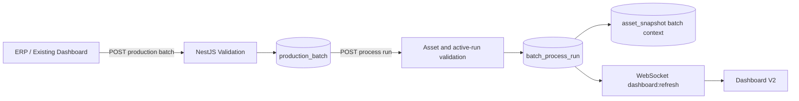

# External Batch Ingestion API v1.0

**Dashboard:** V2.1  
**Base URL lokal:** `http://localhost:8787/api/v1/batch`

API ini menerima master production batch dan pelaksanaan proses dari ERP, Node-RED, dashboard produksi lain, atau aplikasi planning.

## Keamanan

Set `INGEST_API_KEY` pada `.env` backend. Jika nilai ini diisi, setiap POST wajib membawa header:

```http
X-API-Key: API_KEY_ANDA
Content-Type: application/json
```

Mode lokal tetap dapat berjalan tanpa API key ketika `INGEST_API_KEY` kosong. Untuk jaringan produksi, API key wajib diisi dan endpoint sebaiknya ditempatkan di belakang reverse proxy HTTPS.

## 1. POST Production Batch

`POST /api/v1/batch/production-batches`

```json
{
  "batch_no": "BATCH-20260822-001",
  "customer_name": "Customer Textile A",
  "fabric_type": "Cotton Combed 30s",
  "fabric_weight_gsm": 180,
  "target_width_cm": 181,
  "target_output_kg": 850,
  "delivery_target_at": "2026-08-25T08:00:00+07:00",
  "batch_status": "PLANNED",
  "source_system": "ERP_PRODUCTION",
  "external_reference": "WO-2026-00081",
  "source_updated_at": "2026-08-22T13:00:00+07:00",
  "metadata": {
    "color_code": "NAVY-042",
    "customer_order": "PO-88102"
  }
}
```

`batch_no` adalah primary business key. Pengiriman ulang nomor yang sama akan menghasilkan `UPDATED`, bukan row baru.

Status yang diterima: `PLANNED`, `IN_PROCESS`, `HOLD`, `COMPLETED`, `CANCELLED`.

## 2. POST Batch Process Run

Production batch dan asset harus sudah terdaftar.

`POST /api/v1/batch/process-runs`

Identifier idempotensi dapat dikirim melalui salah satu field/header berikut: `external_run_id`, `message_id`, `process_run_id` berupa UUID, atau header `Idempotency-Key`.

```json
{
  "external_run_id": "ERP-RUN-000991",
  "batch_no": "BATCH-20260822-001",
  "asset_id": "KL-DPN-05",
  "process_type": "kalender",
  "recipe_code": "KL-COTTON-180",
  "run_status": "RUNNING",
  "started_at": "2026-08-22T10:00:00+07:00",
  "progress_percent": 42.5,
  "source_system": "ERP_PRODUCTION",
  "source_updated_at": "2026-08-22T10:51:00+07:00",
  "metadata": {
    "operator_id": "OP-018",
    "shift": "A"
  }
}
```

Untuk menyelesaikan run, kirim kembali `source_system` dan `external_run_id` yang sama:

```json
{
  "external_run_id": "ERP-RUN-000991",
  "batch_no": "BATCH-20260822-001",
  "asset_id": "KL-DPN-05",
  "run_status": "COMPLETED",
  "ended_at": "2026-08-22T12:00:00+07:00",
  "output_quantity": 792.4,
  "output_unit": "m",
  "progress_percent": 100,
  "source_system": "ERP_PRODUCTION",
  "source_updated_at": "2026-08-22T12:00:05+07:00"
}
```

Status run yang diterima: `PLANNED`, `RUNNING`, `HOLD`, `COMPLETED`, `CANCELLED`, `FAILED`.

Hanya satu process run berstatus `RUNNING` atau `HOLD` yang diperbolehkan pada satu asset. Konflik menghasilkan HTTP `409`.

## Response

```json
{
  "data_mode": "ACTUAL_DATABASE",
  "operation": "CREATED",
  "run": {
    "process_run_id": "generated-uuid",
    "external_run_id": "ERP-RUN-000991",
    "batch_no": "BATCH-20260822-001",
    "asset_id": "KL-DPN-05",
    "run_status": "RUNNING"
  }
}
```

Nilai `operation`:

- `CREATED`: row baru dibuat;
- `UPDATED`: identifier yang sama memperbarui row lama;
- `IGNORED_STALE`: payload memiliki `source_updated_at` lebih lama dan tidak diterapkan.

## Urutan Integrasi



Node-RED cukup mengirim JSON dengan HTTP Request node. Database tidak ditembak langsung dari Node-RED; NestJS menangani validasi, idempotency, transaksi, dan refresh dashboard.

## Troubleshooting

- HTTP `400`: field wajib, status, UUID, timestamp, atau angka tidak valid.
- HTTP `404`: `batch_no` belum ada di `production_batch`, atau `asset_id` belum terdaftar.
- HTTP `409`: mesin masih memiliki active run atau identifier bertabrakan dengan record lain.
- HTTP `500`: response memuat `request_id`, `database_code`, dan diagnostic pada environment lokal untuk membantu penelusuran.

Pastikan production batch dikirim terlebih dahulu sebelum process run.
