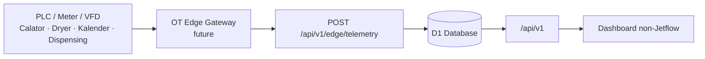

# Non-Jetflow Backend Integration v1.0

**Tanggal:** 15 Agustus 2026  
**Status:** Implemented foundation — demo seed, read-only  
**Scope aktif:** Calator, Dryer, Kalender, Chemical Dispensing Calator, dan snapshot Utilities. Jetflow sengaja belum menggunakan backend ini.

## 1. Hasil implementasi

Dashboard kini memiliki backend API dan persistent storage D1 untuk aset non-Jetflow. Saat deployment pertama, database membuat seed data yang merepresentasikan 50 aset:

| Proses | Jumlah | Area |
|---|---:|---|
| Calator | 18 | Depan, Belakang, Timur |
| Dryer | 6 | Depan, Belakang, Timur |
| Kalender | 21 | Depan, Belakang, Timur |
| Chemical Dispensing Calator | 5 | Depan, Belakang, Timur |
| **Total** | **50** |  |

Data ini masih berlabel `SIMULATED_SEED`; bukan data PLC produksi. Label tersebut akan berubah ketika gateway OT sudah mengirim telemetry nyata.

## 2. Integrasi yang sudah berjalan

Dashboard saat dibuka memanggil API untuk memuat:

- Fleet dan status mesin Calator, Dryer, Kalender, serta Dispensing.
- Snapshot asset: state, batch, progress, connection, timestamp, dan data quality.
- Chemical Dispensing request/weighting/transfer log.
- Snapshot utility: electrical demand, water rate, steam flow, dan thermal oil supply.

Jika backend belum tersedia, dashboard tetap beroperasi dengan demo fallback lokal dan indikator sidebar akan menyatakannya secara jelas.

## 3. Database yang diimplementasikan

| Tabel | Fungsi |
|---|---|
| `asset` | Master 50 aset non-Jetflow, lokasi, subtype, dan konfigurasi mesin. |
| `asset_snapshot` | Nilai/status live terakhir per asset. |
| `tag_definition` | Canonical tag awal per asset dengan status mapping `PENDING_MAPPING`. |
| `telemetry_sample` | Historian telemetry yang diterima dari gateway; deduplikasi per `message_id` dan tag. |
| `chemical_transaction` | Request code, Calator tujuan, chemical, target/actual, mode, status, operator, dan waktu. |
| `utility_snapshot` | Snapshot utilitas terbaru untuk dashboard. |
| `backend_meta` | Penanda migrasi/seed agar data awal tidak dibuat berulang. |

Migration berada pada `drizzle/0000_non_jetflow_backend.sql`; runtime juga melakukan `CREATE TABLE IF NOT EXISTS` secara aman untuk memastikan instance baru dapat dimulai tanpa manual setup.

## 4. Endpoint API

| Endpoint | Fungsi | Scope |
|---|---|---|
| `GET /api/v1/integration/status` | Status D1, mode data, jumlah asset per proses, dan status kesiapan ingestion. | Non-Jetflow |
| `GET /api/v1/assets?process=calator|dryer|kalender|chemical&area=` | Fleet asset serta snapshot live. | Non-Jetflow |
| `GET /api/v1/assets/{assetId}/snapshot` | Detail snapshot dan canonical tag asset. | Non-Jetflow |
| `GET /api/v1/dispensing/transactions?asset_id=&from=&to=` | Log chemical dispensing dengan filter unit/waktu. | Dispensing Calator |
| `GET /api/v1/utilities/snapshot` | Nilai utilitas terbaru. | Utility |
| `POST /api/v1/edge/telemetry` | Contract ingestion untuk OT gateway. | Terkunci sampai credential diaktifkan |

Endpoint ingest tidak aktif tanpa secret `EDGE_INGEST_TOKEN`. Setelah secret terpasang, gateway mengirim bearer token serta payload berisi `asset_id`, `gateway_id`, `message_id`, dan daftar sample. Tidak ada endpoint write-back ke PLC.

## 5. Canonical tag awal yang disiapkan

| Proses | Contoh tag yang disiapkan |
|---|---|
| Calator | `FEEDING.SPEED_PV`, `SQUEEZING_01.SPEED_PV`, `OVERFEED_OUT.SPEED_PV`, `DANCER.POSITION_PV`, `PRODUCTION.OUTPUT_TOTAL_M` |
| Dryer | `LINE.SPEED_PV`, `CHAMBER_01/02.TEMP_PV`, `THERMAL_OIL.SUPPLY_TEMP_PV`, `PRODUCTION.OUTPUT_TOTAL_M` |
| Kalender | Loadcell upper/lower, temperature upper/lower, dancer position, fabric width |
| Dispensing | Tank 1 total loadcell, Tank 2 level, inlet valve feedback, transfer valve feedback |

Setiap tag tetap harus direkonsiliasi dengan tag PLC aktual, unit, scaling, update rate, dan alarm limit sebelum statusnya diubah dari `PENDING_MAPPING` menjadi produksi.

## 6. Yang belum diaktifkan

- Koneksi OPC UA/Modbus aktual dan IP gateway.
- Credential `EDGE_INGEST_TOKEN` serta certificate/mTLS gateway.
- Historian TimescaleDB jangka panjang; D1 saat ini menjadi fondasi integrasi dashboard dan master/transaction pilot.
- Query PV/SV, motor R/S/T, event state, dan batch context dari PLC/MES aktual.
- Integrasi Jetflow.

## 7. Urutan commissioning berikutnya

1. Pilih satu pilot Calator atau Kalender dan konfirmasi PLC/protocol/tag list.
2. Mapping tag ke `tag_definition`, validasi PV/unit/scaling terhadap HMI.
3. Pasang gateway collector dan secret ingestion; kirim telemetry read-only.
4. Ganti asset snapshot/chemical log seed dengan data aktual secara bertahap.
5. Setelah pilot stabil, lanjut Dryer, dispensing, seluruh area, lalu Jetflow.

## Keputusan v1.0

- Backend awal sengaja berfokus pada 50 aset non-Jetflow.
- D1 dipakai sebagai persistence aplikasi/dashboard pilot; arsitektur PostgreSQL + TimescaleDB tetap menjadi target historian produksi skala besar.
- Seluruh jalur tetap read-only; tidak ada command dashboard atau AI ke mesin.
