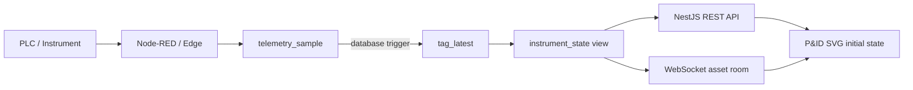

# P&ID Live State Architecture v1.0

**Tanggal:** 24 Agustus 2026  
**Status:** Implemented foundation  
**Scope:** Latest canonical tag, operational instrument projection, REST API, dan WebSocket asset room

## Keputusan penamaan

Tabel persistence utama menggunakan nama `tag_latest`, bukan `instrument_state`.

Alasannya, canonical tag tidak hanya mewakili instrument. Tag juga dapat mewakili:

- valve dan actuator;
- motor dan drive;
- sensor analog;
- machine state;
- counter dan totalizer;
- setpoint;
- alarm/interlock;
- virtual atau calculated signal.

Nama `instrument_state` tetap disediakan sebagai read-only database view untuk kebutuhan P&ID dan dashboard operasional. View ini menerjemahkan data teknis `tag_latest` menjadi `element_code`, `parameter_code`, effective quality, dan semantic state.

## Alur data



Node-RED tidak perlu melakukan query tambahan. Insert ke `telemetry_sample` otomatis menjalankan trigger `trg_sync_tag_latest_from_telemetry`.

## Pembagian tanggung jawab data

| Sumber | Tanggung jawab |
|---|---|
| `telemetry_sample` | Seluruh histori dan sumber audit nilai tag |
| `tag_latest` | Satu nilai terbaru untuk setiap canonical tag |
| `instrument_state` | Projection read-only untuk P&ID dan operational UI |
| `asset_snapshot` | Ringkasan mesin: state, batch aktif, progress, connected, dan current process |
| `equipment_snapshot` | Ringkasan khusus equipment/motor yang sudah dibakukan |

## Struktur `tag_latest`

Primary key menggunakan `tag_code`, karena satu canonical tag hanya memiliki satu nilai terbaru.

Kolom utama:

```text
tag_code
asset_id
value_number
value_text
quality
source_ts
ingested_at
gateway_id
message_id
updated_at
```

Trigger hanya menerima sample yang timestamp sumber/ingestion-nya sama atau lebih baru. Sample historis yang datang terlambat tetap masuk historian tetapi tidak menimpa live state yang lebih baru.

## Projection `instrument_state`

View menghasilkan:

```text
asset_id
tag_code
element_code
parameter_code
signal_role
engineering_unit
value_number / value_text / boolean_value
raw_quality / effective_quality
semantic_state
source_ts
updated_at
```

Contoh canonical tag:

```text
SMM.DSP-DPN-01.INLET_VALVE_01.OPEN_FB
```

Diuraikan menjadi:

```text
asset_id      = DSP-DPN-01
element_code  = INLET_VALVE_01
parameter     = OPEN_FB
semantic      = OPEN atau CLOSED
```

Legacy tag yang masih mengulang area sebelum asset juga dapat dibaca karena parser mencari posisi `asset_id`, bukan bergantung pada nomor segmen tetap.

## Data quality dan stale

`tag_definition.stale_after_seconds` menentukan batas umur live signal. Default awal adalah 30 detik dan dapat diubah per tag sesuai scan interval serta kebutuhan proses.

Urutan kualitas:

1. `BAD`, `STALE`, dan `NOT_CONNECTED` dari collector dipertahankan.
2. Nilai `GOOD` menjadi `STALE` jika `source_ts` melewati batas tag.
3. P&ID harus memprioritaskan effective quality sebelum memberi warna running/open.

## Semantic state baseline

View menyediakan normalisasi umum:

| Signal | Boolean | Semantic state |
|---|---:|---|
| `OPEN_FB` | true | `OPEN` |
| `OPEN_FB` | false | `CLOSED` |
| `RUN_FB` | true | `RUNNING` |
| `RUN_FB` | false | `STOPPED` |
| `FAULT_FB` / `TRIP_FB` | true | `FAULT` |
| alarm boolean | true | `ALARM` |
| analog PV/SV | — | `VALUE` |
| data melewati stale limit | — | `STALE` |

Rule kompleks seperti kombinasi open/close feedback, transition timeout, permissive, interlock, dan derived flow state tetap akan dibuat pada P&ID state-rule layer berikutnya.

## REST API

Initial state per asset:

```text
GET /api/v1/assets/{assetId}/instrument-states
```

Filter element:

```text
GET /api/v1/assets/DSP-DPN-01/instrument-states?element=INLET_VALVE_01
```

Delta berbasis waktu:

```text
GET /api/v1/assets/DSP-DPN-01/instrument-states?changed_after={ISO_TIMESTAMP}
```

Response membawa `snapshot_version` untuk cursor/reconnect.

## WebSocket

Client memilih asset:

```json
{
  "event": "asset:subscribe",
  "data": { "asset_id": "DSP-DPN-01" }
}
```

Backend memasukkan socket ke room:

```text
asset:DSP-DPN-01
```

Perubahan live dikirim melalui event:

```text
instrument:delta
```

Dashboard tidak menerima telemetry seluruh plant. Hanya perubahan asset yang sedang dibuka dikirim ke browser.

## Validasi implementasi

- Trigger terverifikasi memperbarui `tag_latest` dari insert historian aktual.
- REST initial state dan filter element merespons HTTP 200.
- WebSocket subscription menerima delta aktual untuk asset yang dipilih.
- Transactional verification `INLET_VALVE_01.OPEN_FB = true` menghasilkan semantic state `OPEN` dan di-rollback setelah pengujian, sehingga tidak meninggalkan dummy data.
- Data lama yang tidak lagi diperbarui ditampilkan sebagai `STALE`.

## Tahap berikutnya

1. Tambahkan `pid_template`, `pid_element`, dan `pid_binding`.
2. Buat template SVG pertama untuk Dispensing Calator.
3. Mapping `element_code` SVG ke canonical tag.
4. Tambahkan state-rule versioning untuk valve, motor, tank, pipe, dan alarm.
5. Terapkan renderer yang memperbarui class/value elemen tanpa merender ulang seluruh SVG.
