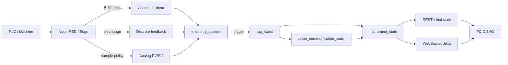

# P&ID Live State Architecture v1.1

**Tanggal:** 26 Agustus 2026  
**Status:** Implemented  
**Scope:** Satu heartbeat per asset, latest state, historian, REST, dan WebSocket P&ID

## Keputusan utama

Setiap mesin/asset memiliki tepat satu heartbeat komunikasi:

```text
SMM.{ASSET_ID}.COMMUNICATION.HEARTBEAT
```

Contoh:

```text
SMM.DSP-DPN-01.COMMUNICATION.HEARTBEAT
SMM.KL-DPN-05.COMMUNICATION.HEARTBEAT
```

Heartbeat mewakili kesehatan jalur data asset dari PLC/edge hingga PostgreSQL. Valve, actuator, motor, dan device lain pada asset yang sama tidak perlu mengirim heartbeat sendiri.

## Dua lapis freshness

Satu heartbeat mesin tidak boleh membuat nilai analog yang membeku terlihat sehat. Karena itu terdapat dua mode pada `tag_definition.freshness_mode`:

| Mode | Dipakai oleh | Aturan |
|---|---|---|
| `ASSET_HEARTBEAT` | feedback diskrit seperti `OPEN_FB`, `RUN_FB`, `FAULT_FB`, `STATUS`, dan `STATE` | State terakhir tetap valid selama heartbeat asset `GOOD` |
| `TAG_TIMESTAMP` | PV, SV, speed, temperature, loadcell, flow, counter, dan heartbeat itu sendiri | Tag wajib memiliki timestamp yang masih segar |

Dengan model ini, komunikasi semua device tetap bergantung pada heartbeat mesin, tetapi validitas pengukuran analog juga diperiksa secara individual.

## Alur data



## Kontrak pengiriman Node-RED

### Heartbeat

- interval rekomendasi: 5–10 detik;
- `value_number = 1`;
- `quality = GOOD`;
- `source_ts` menggunakan waktu sumber terbaru;
- `message_id` selalu unik;
- `gateway_id` mengidentifikasi edge/collector;
- batas awal stale: 30 detik.

Jika Node-RED, PLC, jaringan, atau jalur database berhenti mengirim, backend otomatis mengubah komunikasi asset menjadi `STALE` setelah 30 detik. Tidak perlu mengirim angka nol pada saat koneksi benar-benar putus. Nilai `0` dapat dikirim saat edge masih hidup tetapi mengetahui PLC sedang disconnected; hasilnya `NOT_CONNECTED`.

### Feedback diskrit

Valve dan feedback diskrit dikirim:

1. ketika nilainya berubah;
2. sebagai full-state snapshot ketika Node-RED reconnect/start;
3. sebagai reconciliation berkala, misalnya setiap 5–15 menit.

Dengan demikian historian mencatat perubahan `OPEN`/`CLOSED` tanpa menumpuk row yang sama setiap beberapa detik. Heartbeat-lah yang membuktikan bahwa state terakhir tersebut masih dapat dipercaya.

### Nilai analog

PV/SV tetap dikirim berdasarkan sample policy masing-masing tag. `source_ts` analog tetap diperiksa walaupun heartbeat mesin sehat.

## Database

Migration database dicatat pada `schema_migration`. NestJS hanya menjalankan file yang belum pernah diterapkan dan memakai PostgreSQL advisory lock agar dua instance backend tidak menjalankan migration bersamaan.

### `telemetry_sample`

Historian append-only untuk heartbeat, perubahan feedback, dan sample analog.

### `tag_latest`

Satu row nilai terbaru per canonical tag. Trigger `trg_sync_tag_latest_from_telemetry` memperbaruinya otomatis.

### `asset_communication_state`

View read-only yang menghitung satu kondisi komunikasi per asset:

- `GOOD`: heartbeat bernilai aktif, quality baik, dan belum stale;
- `STALE`: heartbeat terakhir melewati batas waktu;
- `NOT_CONNECTED`: belum ada heartbeat, heartbeat bernilai mati, atau sumber menyatakan disconnected;
- `BAD`: heartbeat diterima tetapi payload/quality tidak dapat dipercaya.

### `instrument_state`

View P&ID menggabungkan nilai device dengan komunikasi asset dan menghasilkan:

```text
raw_quality
effective_quality
communication_quality
freshness_mode
heartbeat_source_ts
semantic_state
```

## REST API

Status komunikasi satu asset:

```text
GET /api/v1/assets/{assetId}/communication
```

Initial state seluruh instrument:

```text
GET /api/v1/assets/{assetId}/instrument-states
```

Response instrument menyertakan `freshnessMode`, `communicationQuality`, dan `heartbeatSourceTs` agar UI maupun client eksternal dapat menjelaskan sumber kualitasnya.

## WebSocket

Backend memeriksa perubahan komunikasi setiap dua detik.

- Update heartbeat yang tetap `GOOD` hanya menghasilkan delta tag heartbeat.
- Transisi `GOOD → STALE`, `STALE → GOOD`, atau `GOOD → NOT_CONNECTED` mengirim ulang seluruh state asset ke room `asset:{assetId}`.
- Browser hanya menerima asset yang sedang dibuka, bukan seluruh plant.

Pendekatan ini mencegah polling dan render seluruh P&ID pada setiap heartbeat, tetapi tetap membuat semua device berubah menjadi neutral/stale segera saat koneksi asset bermasalah.

## State visual P&ID

| Kondisi | Tampilan |
|---|---|
| Heartbeat `GOOD`, valve `OPEN_FB = 1` | Hijau / open |
| Heartbeat `GOOD`, valve `OPEN_FB = 0` | Closed / inactive sesuai theme |
| Heartbeat stale atau disconnected | Abu-abu/stale untuk seluruh device asset |
| Feedback `FAULT_FB = 1` dengan heartbeat sehat | Fault/alarm |
| Analog stale walaupun heartbeat sehat | Nilai analog stale secara individual |

## Hasil validasi

- 138 heartbeat canonical terdaftar, satu untuk setiap asset aktif.
- 128 feedback diskrit menggunakan `ASSET_HEARTBEAT`.
- Valve dengan timestamp feedback lama tetap `OPEN/GOOD` saat heartbeat sehat.
- Valve yang sama otomatis menjadi `STALE` saat heartbeat melewati 30 detik.
- Pengujian dilakukan dalam transaction dan di-rollback; tidak ada dummy telemetry yang ditinggalkan.

## Aturan commissioning

1. Node-RED mulai mengirim heartbeat untuk asset pilot.
2. Verifikasi endpoint communication menghasilkan `GOOD`.
3. Kirim full snapshot seluruh feedback setelah connect.
4. Uji putus koneksi lebih dari 30 detik; P&ID harus berubah stale.
5. Sambungkan kembali; heartbeat pertama harus memulihkan komunikasi dan full snapshot feedback harus menyelaraskan state aktual.
