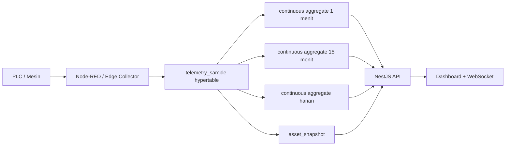

# TimescaleDB Historian Integration v1.0

**Tanggal:** 22 Agustus 2026  
**Status:** Aktif pada PostgreSQL lokal  
**Versi:** PostgreSQL 18.6 + TimescaleDB 2.29.2

## Tujuan

TimescaleDB dipakai sebagai lapisan historian untuk telemetry berfrekuensi tinggi. Master asset, tag, batch, alarm, chemical, maintenance, dan snapshot tetap memakai tabel relasional PostgreSQL biasa. Pemisahan ini menjaga transaksi MES tetap sederhana sekaligus membuat query trend harian, mingguan, dan bulanan lebih efisien.

## Alur data aktif



Node-RED tetap mengirim satu sampel per tag ke `telemetry_sample`. Perubahan menjadi hypertable tidak mengubah kontrak `INSERT ... ON CONFLICT DO NOTHING` yang telah digunakan collector.

## Struktur historian

### Raw telemetry

- Tabel: `telemetry_sample`.
- Partition time: `source_ts`.
- Chunk interval: 1 hari.
- Primary key: `(id, source_ts)`.
- Idempotency: unique `(message_id, tag_code, source_ts)`.
- Index pencarian trend: `(asset_id, tag_code, source_ts DESC)`.
- Columnstore policy: chunk yang berumur lebih dari 7 hari.
- Retention: 30 hari.

### Continuous aggregate

| View | Bucket | Refresh | Retention | Penggunaan |
|---|---:|---:|---:|---|
| `telemetry_cagg_1m` | 1 menit | setiap 1 menit | 400 hari | Trend pendek dan kalkulasi proses |
| `telemetry_cagg_15m` | 15 menit | setiap 5 menit | 3 tahun | Trend mingguan/bulanan |
| `telemetry_cagg_daily` | 1 hari | setiap 1 jam | 10 tahun | Analisis tahunan dan KPI jangka panjang |

Semua aggregate menyimpan jumlah sampel, jumlah quality GOOD/bad, minimum, maksimum, rata-rata, nilai pertama, nilai terakhir, delta, dan timestamp sumber terakhir. Mode real-time aggregate aktif sehingga data terbaru yang belum masuk materialisasi tetap terlihat pada query.

## Routing query backend

Endpoint tetap sama:

```text
GET /api/v1/telemetry/aggregate
```

Parameter `granularity` menentukan sumber:

- `1m` → `telemetry_cagg_1m`;
- `15m` → `telemetry_cagg_15m`;
- `daily` → `telemetry_cagg_daily`.

Endpoint performance summary juga memakai `telemetry_cagg_1m`. Service NestJS tidak lagi menjalankan fungsi native `refresh_telemetry_rollups` ketika extension TimescaleDB aktif. Rollup utility, equipment, dan machine state tetap berjalan seperti sebelumnya karena tabel tersebut belum dimigrasikan menjadi hypertable.

## Retention dan kapasitas

Raw 30 hari dipakai untuk troubleshooting detail dan rekonstruksi proses. Setelah 7 hari, chunk raw dipindahkan ke columnstore untuk mengurangi storage. Historis lebih lama disimpan dalam resolusi agregat sehingga trend bulanan dan tahunan tidak membaca jutaan raw sample.

Retention tidak berarti semua data 30 hari langsung dihapus. TimescaleDB menghapus chunk utuh yang sudah melewati batas kebijakan pada jadwal background job.

## Monitoring operasional

Status integrasi dapat dilihat melalui:

```text
GET /api/v1/integration/status
```

Nilai yang diharapkan:

```json
{
  "storage": "TIMESCALEDB_LOCAL",
  "timescaledb_version": "2.29.2"
}
```

Pemeriksaan database utama:

```sql
SELECT * FROM timescaledb_information.hypertables
WHERE hypertable_name = 'telemetry_sample';

SELECT * FROM timescaledb_information.continuous_aggregates
WHERE view_name LIKE 'telemetry_cagg_%';

SELECT * FROM timescaledb_information.job_stats
ORDER BY job_id;
```

## Backup dan rollback

Backup sebelum migrasi:

```text
Digital Automation Dashboard Backups/
pt_smm_scada_pre_timescaledb_20260822.dump
```

Tabel native `telemetry_aggregate_1m`, `telemetry_aggregate_15m`, dan `telemetry_aggregate_daily` belum dihapus. Tabel tersebut menjadi jalur rollback sementara; backend dapat diarahkan kembali dengan mengganti mapping aggregate tanpa mengubah raw data.

## Batasan tahap ini

- Hypertable baru diterapkan pada raw process telemetry.
- Historian equipment, utility, chemical, dan machine-state masih menggunakan struktur native PostgreSQL.
- Retention 30 hari adalah baseline awal dan perlu dievaluasi menggunakan laju data aktual, kapasitas disk, serta kebutuhan audit produksi.
- Backup database dan pemantauan background job tetap wajib dilakukan secara berkala.
